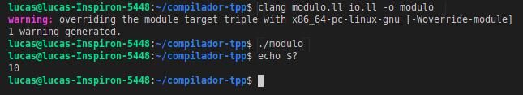

# Geração de Código (Trabalho - 4ª parte)

A geração de código é a última etapa do processo de desenvolvimento de um compilador. Aqui, todos os erros já foram devidamente identificados nas etapas anteriores e isso significa que o código de entrada deve ser compilado pois não apresenta algum erro léxico,sintático ou semântico. A seguir, serão apresentadas as estratégias para geração de código e como funciona a geração, os detalhes de implementação desenvolvida e exemplos de entrada e saı́da.

## Detalhes de Implementação

Para implementar o gerador de código foi utilizada a biblioteca llvmlite do Python. O llvmlite é um binding leve para escrever compiladores JIT. A biblioteca possui funções para geração de variáveis locais e globais, inteiro, flutuante, double, funções e procedimentos com parâmetros de entrada, retorno, estruturas condicionais, operações lógicas e aritiméticas, etc. Quando se trata do código em si, a estrutura base para geração de código intermediário com o  LVMLITE é a seguinte.

```python
from llvmlite import ir

# Criacao do modulo.
modulo = ir.Module(’modulo.bc’)

# Toda a geracao de codigo vai aqui.

# Escreve no modulo (arquivo.ll) e imprime o codigo gerado.

f = open(’modulo.ll’, ’w’)
f.write(str(modulo))
f.close()
print(modulo)
```

Sobre o código base acima, o objeto `ir` é a classe do LLVMLITE que contém todas as funções para geração de código intermediário. O module é o objeto que conterá todo o nosso código gerado afim de ser compilado e executado. O código do autor está todo em um único arquivo nomeado generate code.py. O código é estruturado da seguinte forma: inicialmente são geradas as variáveis globais e estruturas das funções (parâmetros, corpo e retorno) com base nas entradas da tabela de sı́mbolos. A partir daı́, a árvore é percorrida com a função `passar_por_arvore` buscando os nós que representam as funções criadas anteriormente. Quando um nó que representa uma função é encontrado, é chamada a função `preenche_funcao` que é responsável por gerar todo o código presente no corpo daquela função. Com isso, ao final da execução, o código intermediário é completo e se encontra no arquivo modulo.ll. Então, para gerar o arquivo executável é preciso utilizar o seguinte comando no terminal:

```
clang modulo.ll -o modulo
```

Em seguida, executa-se o arquivo module.exe e o programa será executado. É importante ressaltar que, as funções de escrita e leitura utilizam uma implementação externa, desenvolvida em C e integrada ao código. Quando o programa de entrada (em linguagem T++) contém o uso de alguma função leia ou escreva, é necessário utilizar o comando acima colocando junto o arquivo io.ll que contém as funções responsáveis pelas operações de entrada e saı́da. Para tal, é necessário que o código em C tenha sido previamente compilado utilizando um compilador e gerado o arquivo .ll da mesma forma como foi feito para o código de entrada do programa em T++. O comando para montar o arquivo executável com as funções de entrada e saı́da ficará da seguinte forma:

```
clang modulo.ll io.ll -o modulo
```

O arquivo C que contém a implementação das funções de entrada e saı́da é estruturado da seguinte forma:

```c
#include <stdio.h>

void escrevaInteiro(int ni) {
  printf("%d\n", ni);
}

void escrevaFlutuante(float nf) {
  printf("%f\n", nf);
}

int leiaInteiro() {
  int num;
  scanf("%d", &num);
  return num;
}

float leiaFlutuante() {
  float num;
  scanf("%f", &num);
  return num;
}
```

## Exemplo de Entrada e Saı́da
Para melhor entendimento do funcionamento da geração de código, será apresentado um exemplo abaixo. Primeiramente é mostrado o exemplo de entrada, mostrando o código em linguagem T++, e em seguida é apresentado os código intermediário gerado para esse programa, bem como a execução e resultado final gerado após executar o programa. Este exemplo é um código simples que possui declaração de variável global e local, criação da função principal, atribuição e retorno.

```c
inteiro: a

inteiro principal()
  inteiro: b

  a := 10
  b := a

  retorna(b)
fim
```

Quando o gerador de código é executado com este programa de entrada, o código intermediário gerado é o seguinte:

```
; ModuleID = "module.bc"
target triple = "x86_64-unknown-linux-gnu"
target datalayout = "e-m:e-p270:32:32-p271:32:32-p272:64:64-i64:64-f80:128-n8:16:32:64-S128"

declare void @"escrevaInteiro"(i32 %".1") 

declare void @"escrevaFlutuante"(float %".1") 

declare i32 @"leiaInteiro"() 

declare float @"leiaFlutuante"() 

@"a" = common global i32 undef, align 4
define i32 @"main"() 
{
entry:
  %"b" = alloca i32, align 4
  store i32 10, i32* @"a"
  %".3" = load i32, i32* @"a"
  store i32 %".3", i32* %"b"
  %"ret_temp" = load i32, i32* %"b", align 4
  ret i32 %"ret_temp"
}
```

No código acima, pode-se identificar a declaração da variável global ”a”, a função principal com a declaração de b, as atribuições e o retorno ao final da função. Ao executar o comando para compilar este código, e rodando o executável gerado, espera-se que a função tenha retornado o valor 10. A saı́da apresenta o seguinte resultado:

<p align="center">
  
</p>