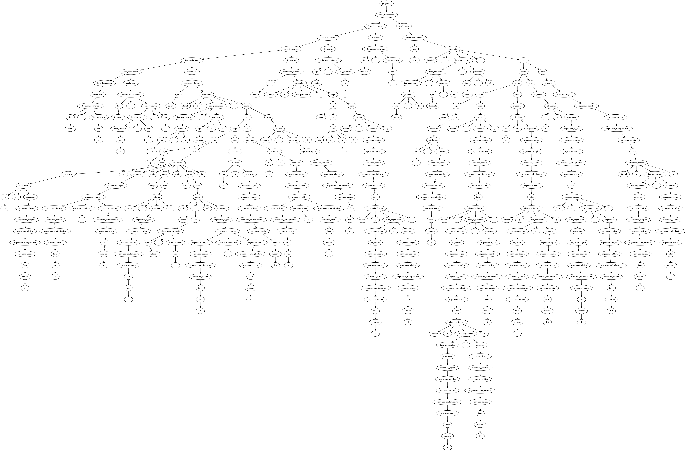
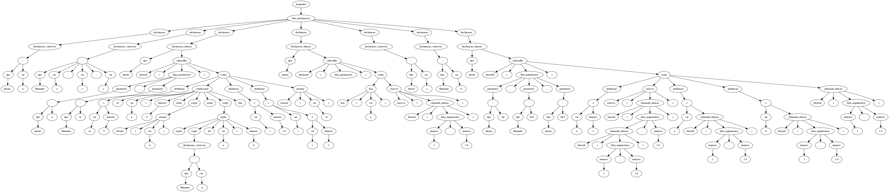

# Análise Semântica (Trabalho - 3ª parte)

Tendo em mãos a árvore sintática gerada na etapa anterior, o próximo passo é implementar o analisador semântico. No entanto, para isso, antes é necessário que a árvore seja podada para que sejam removidos nós desnecessários, facilitando assim o processo de percorrer a árvore para implementar as regras semânticas.

## Poda da Árvore

Para realizar a poda da arvore, os seguintes nós foram considerados passíveis de remocão: ’acao’, ’expressao’, ’expressao logica’, ’expressao simples’, ’expressao aditiva’, ’expressao multiplicativa’, ’expressao unaria’, ’operador relacional’, ’operador logico’, ’operador negacao’, ’fator’, ’lista variaveis’, ’operador soma’ e ’operador multiplicacao’.

As duas imagens abaixo apresentam exemplo de árvore antes da poda e após a poda.

<p align="center">
  
</p>

<p align="center">
  
</p>

Após a poda da árvore, então, a árvore podada deve ser percorrida para a realização da análise sensível ao contexto e geração da tabela de símbolos.

## Tabela de Símbolos
A tabela de símbolos contém todas as variáveis e funções presentes no código, bem como seus atributos (valor, tipo, escopo, dimensões, parãmetros, etc).

## Regras Semânticas

Após a geração da tabela de símbolos, é necessário, de fato, implementar as regras semânticas. Todas as regras foram fornecidas pelo professor orientador da disciplina e estão listadas a seguir. Dentre elas, estão regras de funções e procedimentos, regras de variáveis, coerção implícita, arranjos e atribuições. Por exemplo, todo programa escrito em T++ deve ter uma função principal declarada. Caso o analisador passe pela árvore e não encontre uma função principal, o seguinte erro deve ser retornado: Funcão principal não declarada. Caso uma variável ‘x’ for apenas declarada e não for inicializada (escrita) ou nao for utilizada (não lida), o analisador deve gerar a mensagem de aviso: Variável ‘x’ declarada e não utilizada. Caso uma variável do tipo inteiro receba uma expressão que contém um valor ou variável do tipo flutuante, a seguinte mensagem deve ser retornada: Atribuicão de tipos distintos ‘var’ inteiro e ‘expressão’ flutuante. Esses foram alguns exemplos dentre as várias regras semânticas que foram implementadas.

## Exemplo de Saída
Para melhor compreensão, veja o código abaixo.

```
flutuante: a
inteiro: b

inteiro principal()
  b := 18
  a := 1.0

  a := b
  b := a
fim
```

A análise semântica deste código deve retornar os seguintes erros:

```
ERRO: Funcão principal deveria retornar inteiro, mas retorna vazio.
AVISO: Atribuição de tipos distintos ’ a ’ flutuante e expressão inteiro.
AVISO: Atribuição de tipos distintos ’ b ’ inteiro e expressão flutuante.
```